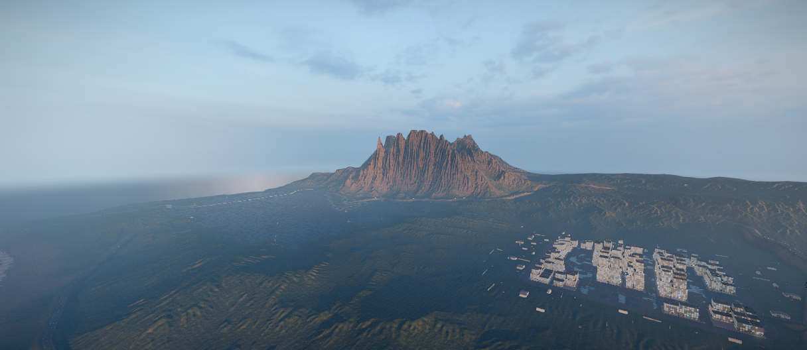
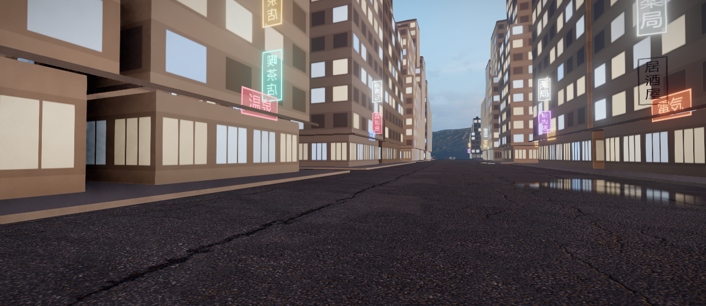
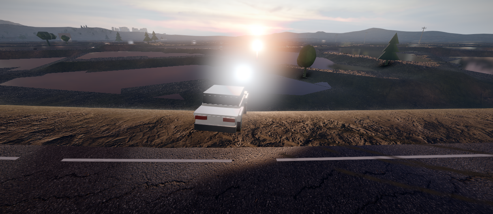
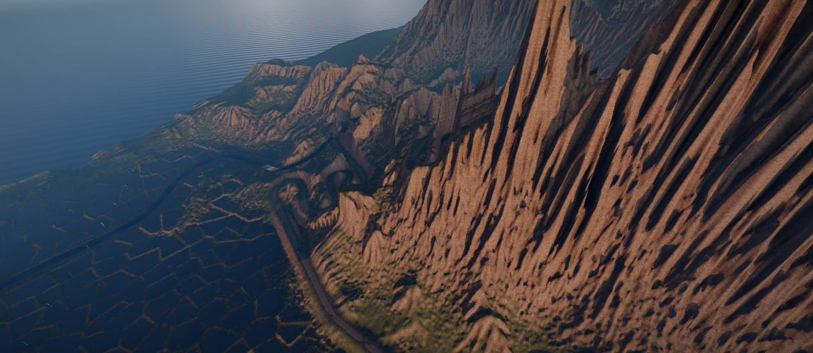
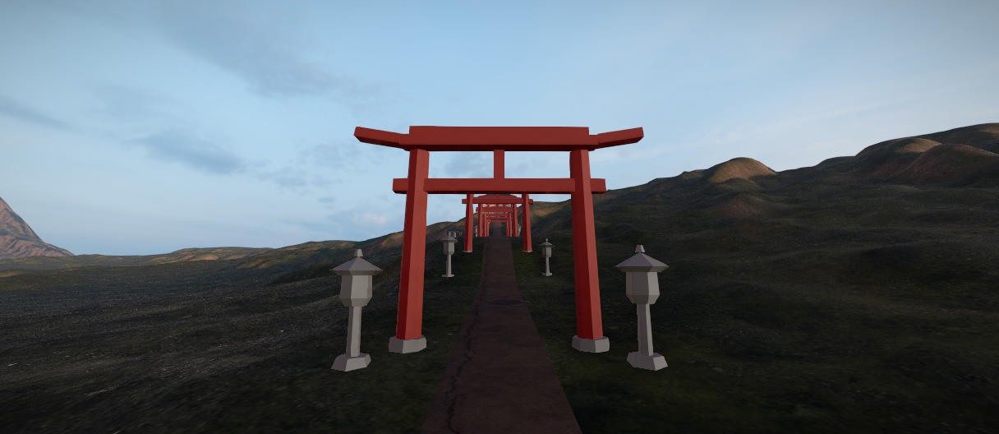
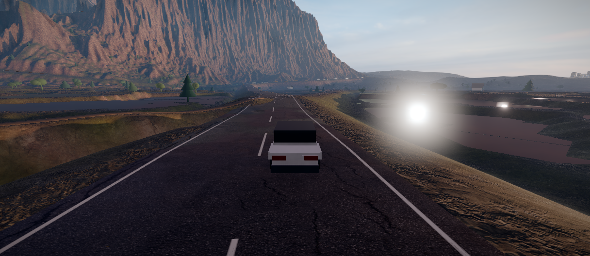
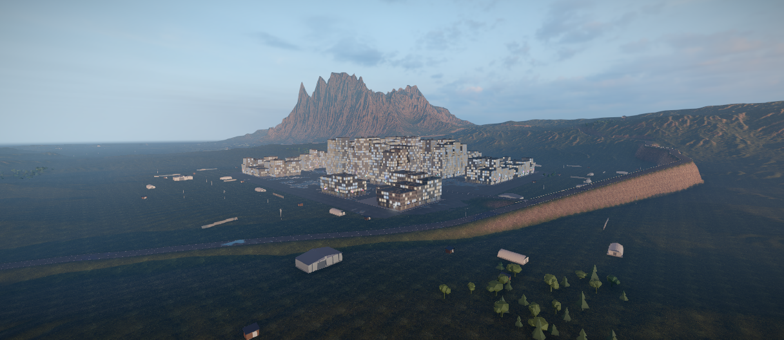
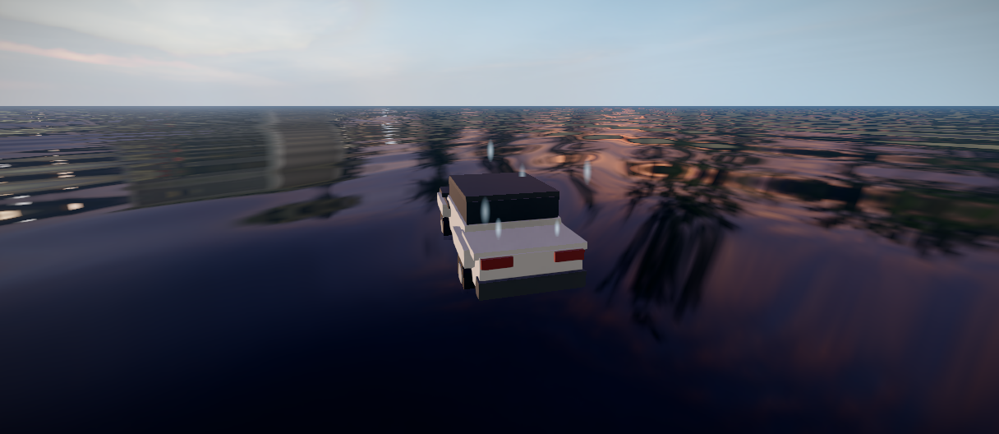
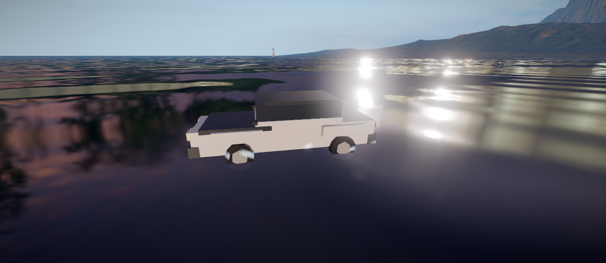

# japanMap

An open-world driving game in the browser: a 3 × 3 km Japanese landscape at
blue hour after rain — mountain pass, forest temple, rice paddies, neon city
and coast — with arcade driving, ten original cars, drift scoring, races
against AI rivals and a walkable sakura court. Built with vanilla Three.js +
TypeScript + Vite, no game engine.



> **Play it:** https://lepro10.github.io/japanMap/
> (deployed from `master` via GitHub Pages)

---

## The game

You start on foot in the sakura bowl. Press **F** to get in the car and drive.

| Input | Action |
|---|---|
| `W` / `S` | throttle / brake (reverse when stopped) |
| `A` / `D` | steer |
| `Space` | handbrake (drift) |
| `C` | camera: chase / hood / cockpit |
| `R` | respawn on the nearest road |
| `F` | get out of the car |
| `M` | world map |
| `V` | free camera |
| `Esc` | menu |

Touch controls (stick + buttons) are built in — the game runs on phones, not
just desktops.

**Content:**

- **10 original cars, one physics model** — Kite S (starter) through Needle 01;
  Street/Sport tune stubs; earn Sparks from races, drift chains and pickups
- **6 events** — 4 races with up to 3 AI rivals
  (Coast Loop, Tōge Descent, Neon Circuit, Tōge Climb), a Ring Time Trial and
  a Tōge Drift Run. A larger catalogue is specified, not yet built
- **Places** — Sakura Commons (on-foot spawn), Stillwater Village, Tideglass
  Harbour, Needle Circuit (2.17 km, 900 m straight), neon city crossing
- **Drift scoring** with chain multiplier up to ×5, doubled in two drift zones
- **Photo mode**, six-tab pause menu, minimap, 6 jump ramps, 90 pickups

The product spec for what is still missing is [`ASTRA_PLAN.md`](ASTRA_PLAN.md);
what is actually shipped, and the next cuts, are in [`PLAN.md`](PLAN.md).




## Screenshots

| | |
|---|---|
|  |  |
|  |  |
|  |  |

All 15 shots live in [`screenshots/`](screenshots/) — including rice fields,
fishing village, open sea and the water-particle test series.

---

## The tech (short version)

- **Baked, deterministic world.** Terrain, roads, shadows and navigation data
  are generated offline from a seed (`npm run world`) and loaded as static
  files — bit-identical on every run. Nothing procedural happens at load time
  that could surprise you.
- **One fixed mood.** No day/night cycle: blue hour after rain, baked terrain
  shadows, height fog, planar reflections on wet asphalt, AgX tone mapping.
- **Scales from phone to desktop.** Five quality presets (ultra → minimal)
  plus a custom tier, an auto-calibration pass and a background asset upgrader.
  Budgets: < 800 draw calls, < 3 M triangles, < 512 MB texture memory.
- **Measured, not claimed.** Every performance statement in this repo comes
  from a run: in-browser benchmarks (`window.japanMap` in dev builds) and
  headless physics test rigs under `tools/bench/`.

Details: [`SPEC.md`](SPEC.md) (what) · [`ARCHITECTURE.md`](ARCHITECTURE.md)
(where) · [`PLAN.md`](PLAN.md) (in what order) · [`CLAUDE.md`](CLAUDE.md) (how
we work). These four are written in German; the game UI itself is English.

---

## Run it locally

Requirements: **Node ≥ 22**.

```bash
npm install
# Do not use `npm run world` on this checkout: it would rebuild the pre-WP6
# eight-road net. Current roads need `--wp6` (see docs/WP6-status.md).
npm run textures
npm run hdri
npm run bake:clean
npm run sun
node tools/gen-roads.mjs --wp6
npm run bake
npm run shade
npm run map
npm run dev     # dev server, then open the printed URL
```

Other useful commands:

```bash
npm run typecheck   # TypeScript, must be clean
npm run build       # production build
npm run preview     # serve the production build
npm run fleet       # vehicle test rig (legacy four-car probes)
npm run test:polish # city / offroad / circuit / tune / smashables
```

> After a fresh clone you must bake before `npm run dev`: `assets/generated/`
> is git-ignored. Use the WP6 chain above, not `npm run world`.

---

## Project layout

```
src/
├── core/     Engine, RenderLoop, EventBus, ResourceManager
├── world/    terrain, roads, water, vegetation, props, city, settlements, stunt
├── game/     driving (10 cars), collision, AI rivals, races, walker, garage
├── render/   post-processing, lighting, reflections, quality, atmosphere
├── audio/    engine + event sounds
├── ui/       start screen, six-tab menu, HUD, photo mode, minimap, touch
├── debug/    dev-only overlay, benchmarks, editors
└── config/   all magic numbers live here, never in code

tools/       terrain/shadow/road bakers, asset pipeline, test rigs (bench/),
             smoke test, image diff
assets/      checked-in sources (HDRIs, textures, props.json)
assets/generated/  baked output (git-ignored, see above)
```

---

## Assets & credits

All third-party assets are **CC0** (public domain), mostly via
[Poly Haven](https://polyhaven.com) — see
[`assets/CREDITS.md`](assets/CREDITS.md) for the full list and authors.
